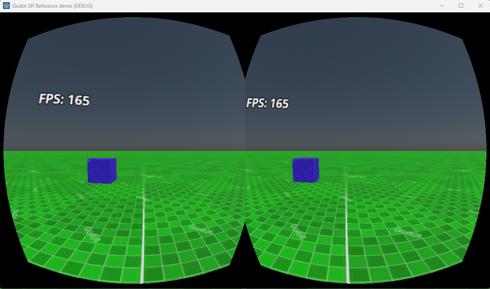
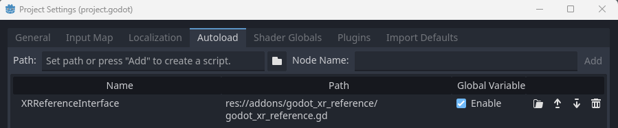

# Godot XR Reference plugin


This is a reference plugin to use as a base to implement XR plugins for Godot 4 and later.

This example XR interface implements simple side by side output with lens distortion and reacts to WASD and mouse input to move the player around. Click on the screen to capture input, press escape to release input.


## Building this plugin
Make sure that when you clone this repository you initialise the submodules recursively.

Simply compile the plugin with:
```
scons target=template_debug
```

> It is important to build debug builds as the editor requires debug builds to run. You can build a release build to distribute alongside your game with `target=template_release`.

# VSCode
For convencience I've added my `tasks.json` build configuration for `vscode` into this repository. This included the above mentioned build instructions.

# Demo

The demo folder contains an example project that implement this interface and is used as the build destination when compiling the plugin.

# Registering the XRInterface

In order for your interface to be accessible within Godot it has to be registered with the XRServer.
As the XRServer isn't accessibly from GDExtensions until after registration has been completed, even though it does exist beforehand, we'll need to handle this with a script.

To ensure the interface is also properly cleaned up we'll create this as an autoload script.
Note that this is marked as a toolscript to ensure the IDE can access meta data provided by the interface.

```
@tool
extends Node

var xr_interface : XRInterfaceReference

func get_interface():
	return xr_interface


func _enter_tree():
	xr_interface = XRInterfaceReference.new()
	if xr_interface:
		XRServer.add_interface(xr_interface)


func _exit_tree():
	if xr_interface:
		XRServer.remove_interface(xr_interface)
		xr_interface = null
```

You can register this script on the autoload tab in the project settings like so:


Note that the demo project also contains a `plugin.cfg` and `plugin.gd` script that will trigger automatic registration of the autoload script. This serves purely as an example and is optional.

# Initialising the interface

To use the interface it has to be initialised. This code is similar to that of other XR interfaces in Godot.

You can do all thats needed in you main script however in our demo a convencience function was added to our autoload script:
```
func start_xr():
	if xr_interface:
		print("Capabilities " + str(xr_interface.get_capabilities()))
		print("Target size " + str(xr_interface.get_render_target_size()))

		if xr_interface.initialize():
			get_viewport().use_xr = true

			print("Initialised")
		else:
			print("Failed to initialise")
	else:
		print("Interface was not instantiated")
```

This can now be called from our main script:

```
func _ready():
	XRReferenceInterface.start_xr()
```

# About the author

This repository is maintained by Bastiaan "Mux212" Olij
Further information to follow.
